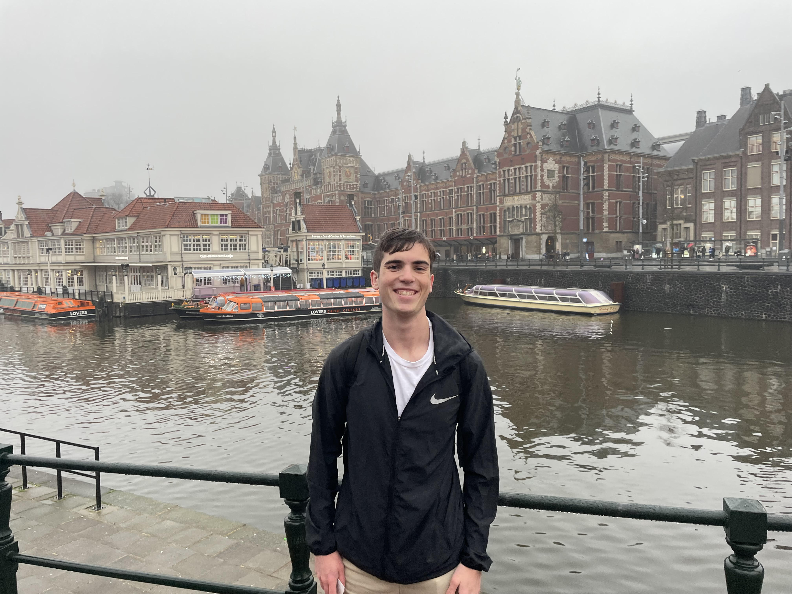

<html lang="en">
<head>
    <meta charset="UTF-8">
    <meta name="viewport" content="width=device-width, initial-scale=1.0">
    <title>About Me</title>
    
</head>
<body>
    

        <h1>Jake Szabo</h1>
        <a href="https://drive.google.com/file/d/13Iji771rR_NpU0B84u-5t5ONnSlcEiB4/view?usp=sharing" target="_blank">My Resume</a>
        <a href="portfolio.html">My Porfolio</a>
    

    

    <h1>About Me</h1>
    
Writing is something that I am deeply passionate about. Throughout my life, I have channeled the things which I was excited to learn about into writing, from media to science. Althought I am currently studying English at the University of California Irvine with the hopes of furthering my craft through a writing career, my college career didn't start out that way. I began at CU Boulder studying Molecular Biology for two years. Though I loved learning about the inner workings of phage genomics, doing PCR in the lab, etc. I realized my greater interest was in writing about all those things! Effective and engaging technical communication drive everything that I do. I have extensive copyediting skills, having worked as a tutor, copy editor, and content writer during my acadmeic career. I have used my own research to aid in formulating business credit agreements and LLC executive summaries. I use SEO to adapt my own writing to the competitive world of content writing as well. I am creating my own technical manuals to share my knowledge and experience with products to others and am taking engineering writing to develop my skills as a project manager and communicating within a team. Currently, I am working on some projects in github, HTML, and XML (like this website :)).

    

    
</body>
</html>
