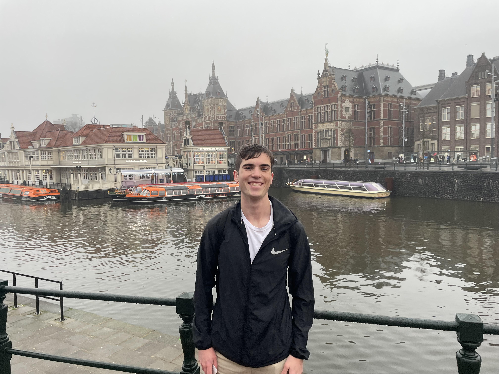

<html lang="en">
<head>
    <meta charset="UTF-8">
    <meta name="viewport" content="width=device-width, initial-scale=1.0">
    <title>About Me</title>
    
</head>
<body>
    

        <h1>Jake Szabo</h1>
        <a href="https://drive.google.com/file/d/13Iji771rR_NpU0B84u-5t5ONnSlcEiB4/view?usp=sharing" target="_blank">My Resume</a>
        <a href="portfolio.html">My Porfolio</a>
    

    

    <h1>About Me</h1>
    
Project Engineer, Cupertino Electric. Graduated UCI 2025. 

    

    
</body>
</html>
